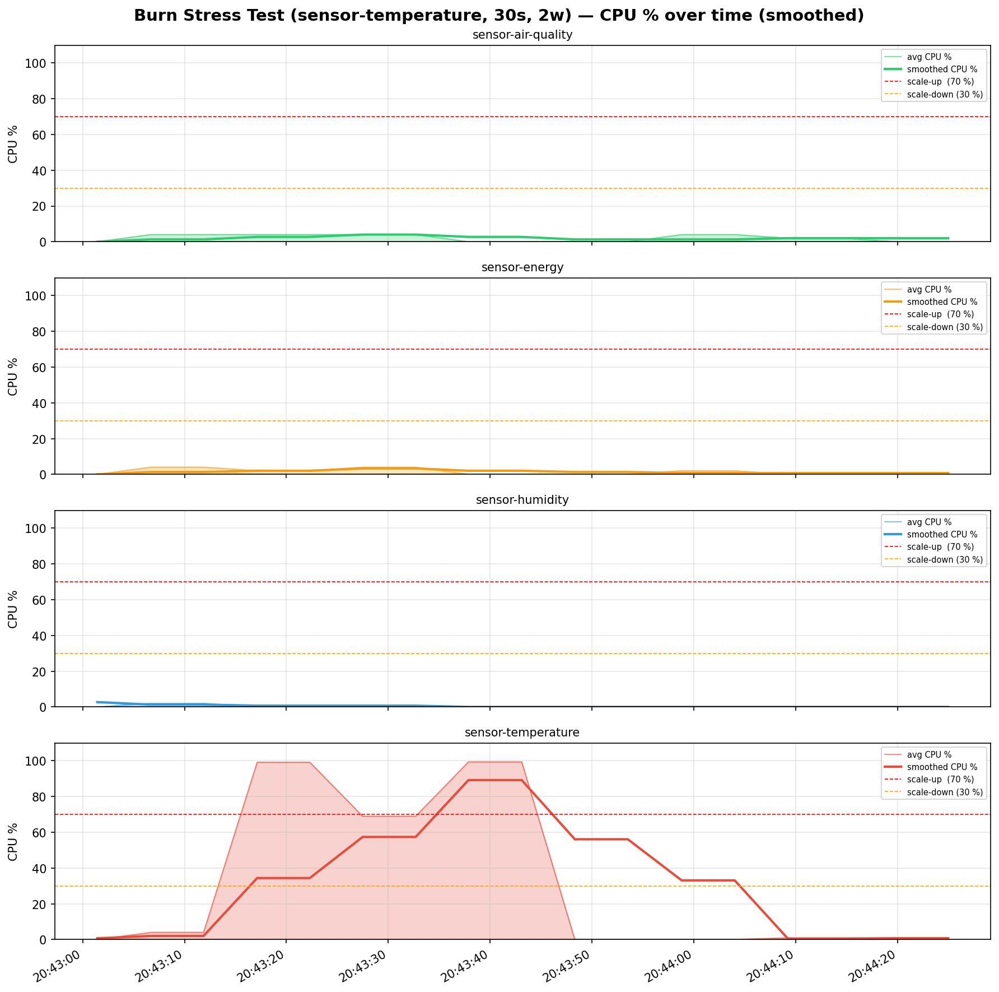
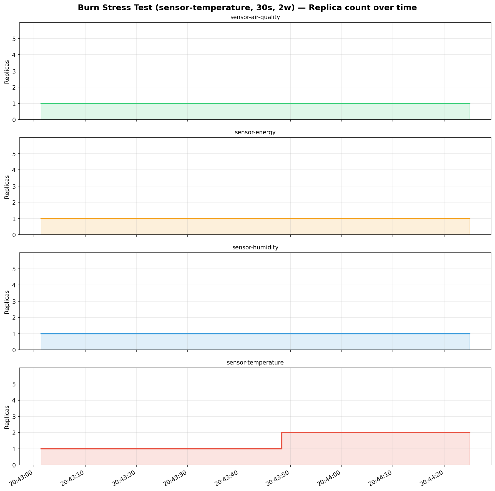
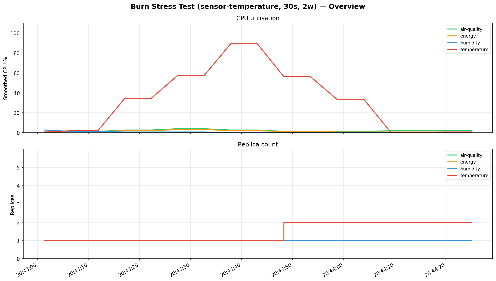

# Burn Stress Test (sensor-temperature, 30s, 2w) — Metrics Report

**Period:** 2026-05-12 20:43:01 UTC → 2026-05-12 20:44:24 UTC (83s)
**Samples collected:** 68
**Sensors monitored:** 4

---

## Summary

| Sensor      |   Samples |   CPU min % |   CPU max % |   CPU avg % |   CPU smooth max % |   Replicas min |   Replicas max |
|-------------|-----------|-------------|-------------|-------------|--------------------|----------------|----------------|
| air-quality |        17 |           0 |         4   |         2.1 |                4   |              1 |              1 |
| energy      |        17 |           0 |         4   |         1.4 |                3.3 |              1 |              1 |
| humidity    |        17 |           0 |         2   |         0.2 |                2.7 |              1 |              1 |
| temperature |        17 |           0 |        99.4 |        32.2 |               89.2 |              1 |              2 |

---

## Scale Events

| Time     | Sensor      |   Old replicas |   New replicas | Event      |   Smoothed CPU % |
|----------|-------------|----------------|----------------|------------|------------------|
| 20:43:48 | temperature |              1 |              2 | ↑ scale-up |             56.1 |

---

## Charts

### CPU utilisation over time

### Replica count over time

### Overview (all sensors)

---

## Raw samples (every 5th)

| Time     | Sensor      |   Replicas |   Avg CPU % |   Smoothed CPU % |
|----------|-------------|------------|-------------|------------------|
| 20:43:01 | temperature |          1 |           0 |              0.7 |
| 20:43:06 | humidity    |          1 |           2 |              1.3 |
| 20:43:11 | energy      |          1 |           4 |              1.3 |
| 20:43:17 | air-quality |          1 |           4 |              2.7 |
| 20:43:27 | temperature |          1 |          69 |             57.4 |
| 20:43:32 | humidity    |          1 |           0 |              0.7 |
| 20:43:37 | energy      |          1 |           0 |              2   |
| 20:43:43 | air-quality |          1 |           0 |              2.7 |
| 20:43:53 | temperature |          2 |           0 |             56.1 |
| 20:43:58 | humidity    |          1 |           0 |              0   |
| 20:44:04 | energy      |          1 |           2 |              0.7 |
| 20:44:09 | air-quality |          1 |           2 |              2   |
| 20:44:19 | temperature |          2 |           1 |              0.7 |
| 20:44:24 | humidity    |          1 |           0 |              0   |
