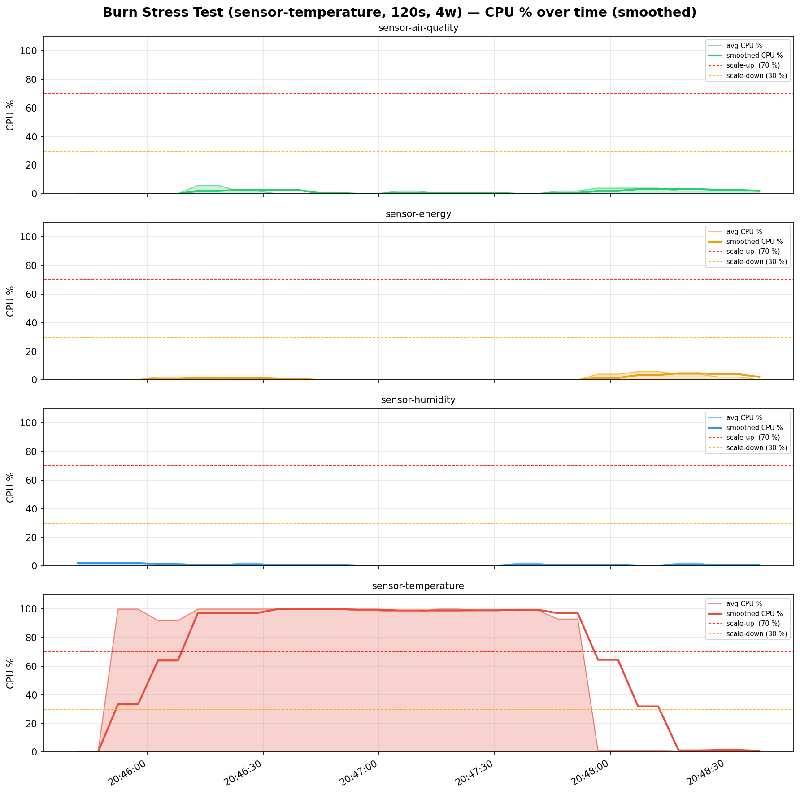
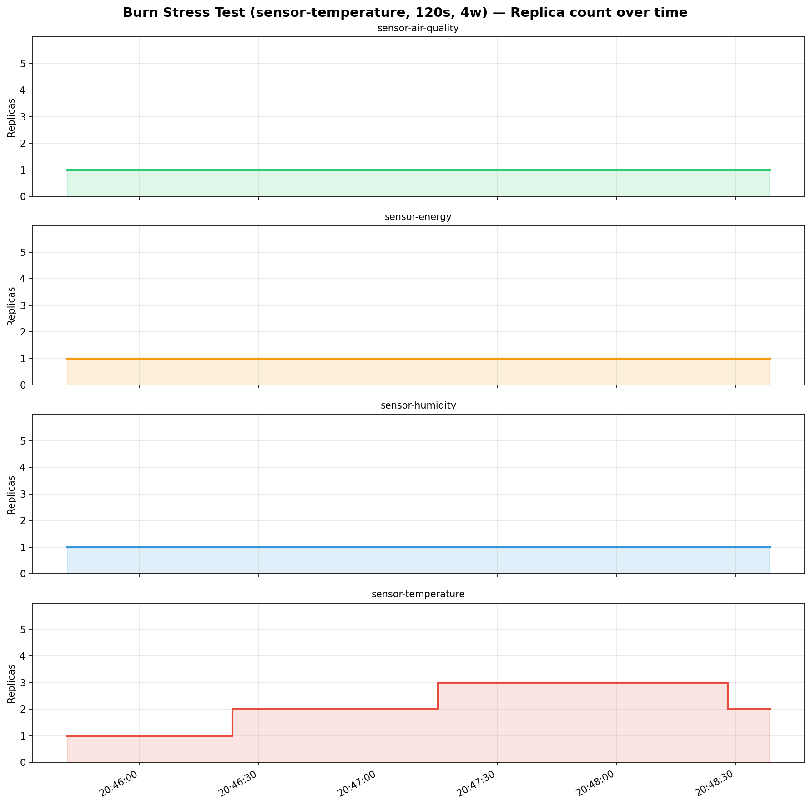
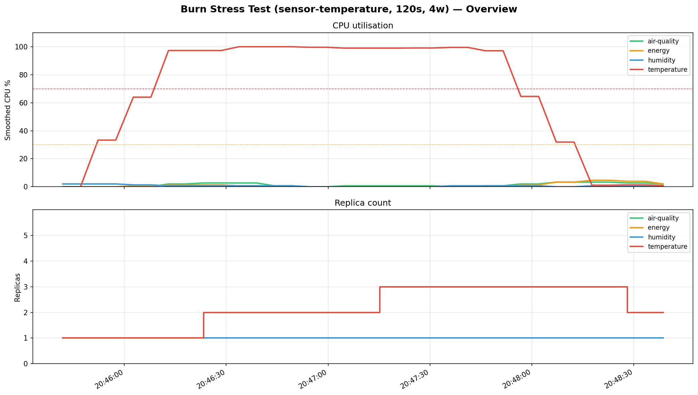

# Burn Stress Test (sensor-temperature, 120s, 4w) — Metrics Report

**Period:** 2026-05-12 20:45:41 UTC → 2026-05-12 20:48:38 UTC (176s)
**Samples collected:** 140
**Sensors monitored:** 4

---

## Summary

| Sensor      |   Samples |   CPU min % |   CPU max % |   CPU avg % |   CPU smooth max % |   Replicas min |   Replicas max |
|-------------|-----------|-------------|-------------|-------------|--------------------|----------------|----------------|
| air-quality |        35 |           0 |         6   |         1.4 |                3.3 |              1 |              1 |
| energy      |        35 |           0 |         5.8 |         1.1 |                4.6 |              1 |              1 |
| humidity    |        35 |           0 |         2   |         0.6 |                2   |              1 |              1 |
| temperature |        35 |           0 |       100   |        67.7 |              100   |              1 |              3 |

---

## Scale Events

| Time     | Sensor      |   Old replicas |   New replicas | Event        |   Smoothed CPU % |
|----------|-------------|----------------|----------------|--------------|------------------|
| 20:46:23 | temperature |              1 |              2 | ↑ scale-up   |             97.3 |
| 20:47:15 | temperature |              2 |              3 | ↑ scale-up   |             99   |
| 20:48:28 | temperature |              3 |              2 | ↓ scale-down |              1.3 |

---

## Charts

### CPU utilisation over time

### Replica count over time

### Overview (all sensors)

---

## Raw samples (every 5th)

| Time     | Sensor      |   Replicas |   Avg CPU % |   Smoothed CPU % |
|----------|-------------|------------|-------------|------------------|
| 20:45:41 | temperature |          1 |         0   |              0   |
| 20:45:47 | humidity    |          1 |         2   |              2   |
| 20:45:52 | energy      |          1 |         0   |              0   |
| 20:45:57 | air-quality |          1 |         0   |              0   |
| 20:46:07 | temperature |          1 |        92   |             64   |
| 20:46:13 | humidity    |          1 |         0   |              0.7 |
| 20:46:18 | energy      |          1 |         2   |              1.3 |
| 20:46:23 | air-quality |          1 |         2   |              2.7 |
| 20:46:33 | temperature |          2 |       100   |            100   |
| 20:46:38 | humidity    |          1 |         0   |              0.7 |
| 20:46:44 | energy      |          1 |         0   |              0   |
| 20:46:49 | air-quality |          1 |         0   |              0.7 |
| 20:46:59 | temperature |          2 |        98.9 |             99.6 |
| 20:47:04 | humidity    |          1 |         0   |              0   |
| 20:47:10 | energy      |          1 |         0   |              0   |
| 20:47:15 | air-quality |          1 |         0   |              0.7 |
| 20:47:25 | temperature |          3 |        99.3 |             99.1 |
| 20:47:30 | humidity    |          1 |         0   |              0   |
| 20:47:35 | energy      |          1 |         0   |              0   |
| 20:47:41 | air-quality |          1 |         0   |              0   |
| 20:47:51 | temperature |          3 |        93   |             97.1 |
| 20:47:56 | humidity    |          1 |         0   |              0.7 |
| 20:48:01 | energy      |          1 |         4   |              1.3 |
| 20:48:07 | air-quality |          1 |         4   |              3.3 |
| 20:48:17 | temperature |          3 |         0.7 |              1.1 |
| 20:48:22 | humidity    |          1 |         2   |              0.7 |
| 20:48:28 | energy      |          1 |         2   |              3.9 |
| 20:48:33 | air-quality |          1 |         2   |              2.7 |
