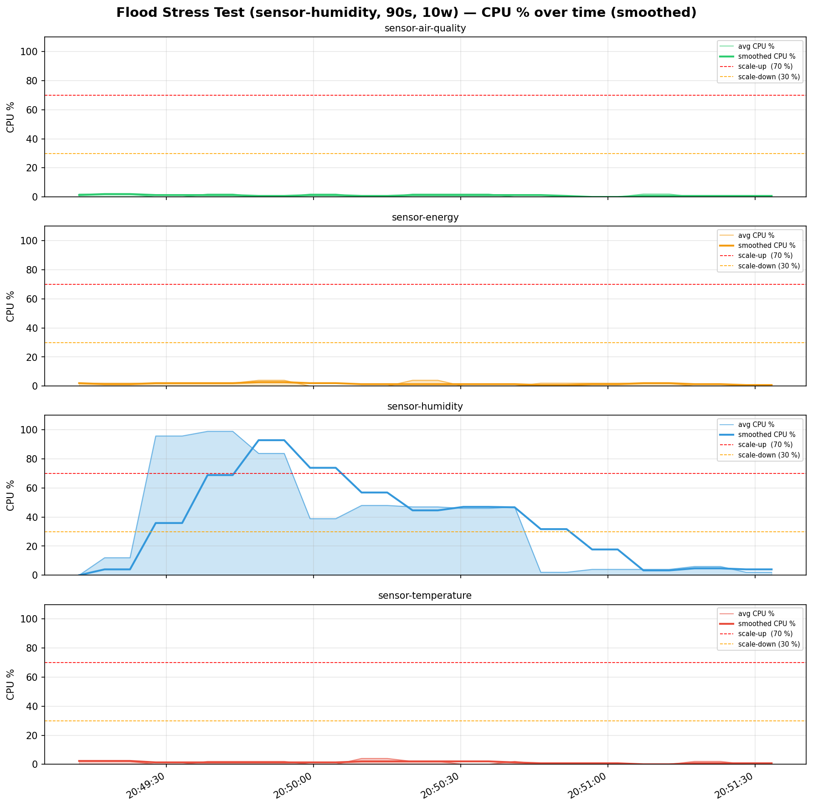
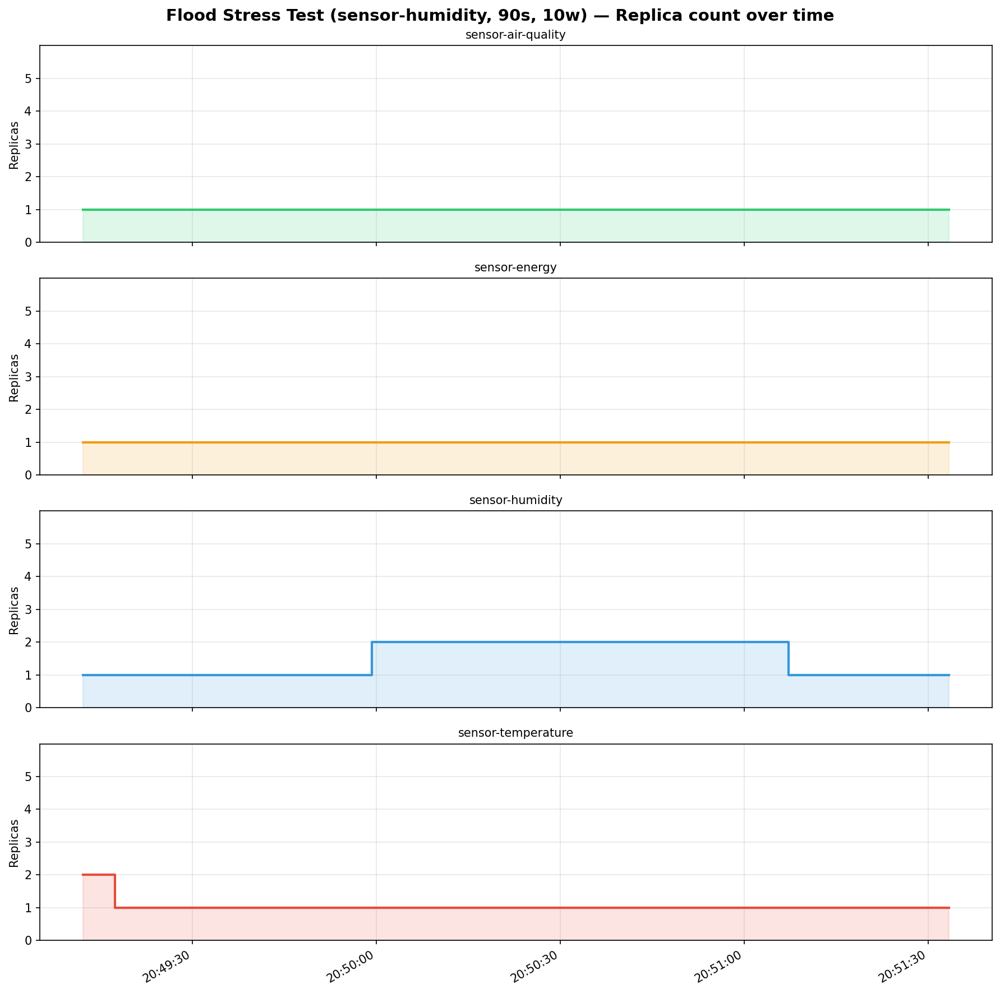
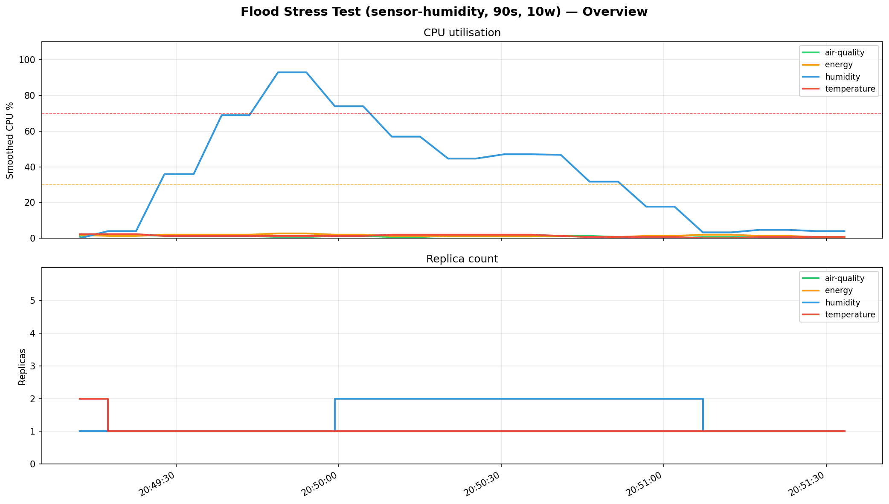

# Flood Stress Test (sensor-humidity, 90s, 10w) — Metrics Report

**Period:** 2026-05-12 20:49:12 UTC → 2026-05-12 20:51:33 UTC (141s)
**Samples collected:** 112
**Sensors monitored:** 4

---

## Summary

| Sensor      |   Samples |   CPU min % |   CPU max % |   CPU avg % |   CPU smooth max % |   Replicas min |   Replicas max |
|-------------|-----------|-------------|-------------|-------------|--------------------|----------------|----------------|
| air-quality |        28 |           0 |           2 |         0.9 |                2   |              1 |              1 |
| energy      |        28 |           0 |           4 |         1.5 |                2.7 |              1 |              1 |
| humidity    |        28 |           0 |          99 |        36.6 |               92.9 |              1 |              2 |
| temperature |        28 |           0 |           4 |         1.1 |                2.3 |              1 |              2 |

---

## Scale Events

| Time     | Sensor      |   Old replicas |   New replicas | Event        |   Smoothed CPU % |
|----------|-------------|----------------|----------------|--------------|------------------|
| 20:49:59 | humidity    |              1 |              2 | ↑ scale-up   |             73.9 |
| 20:51:07 | humidity    |              2 |              1 | ↓ scale-down |              3.3 |
| 20:49:17 | temperature |              2 |              1 | ↓ scale-down |              2.3 |

---

## Charts

### CPU utilisation over time

### Replica count over time

### Overview (all sensors)

---

## Raw samples (every 5th)

| Time     | Sensor      |   Replicas |   Avg CPU % |   Smoothed CPU % |
|----------|-------------|------------|-------------|------------------|
| 20:49:12 | temperature |          2 |           2 |              2.3 |
| 20:49:17 | humidity    |          1 |          12 |              4   |
| 20:49:22 | energy      |          1 |           2 |              1.3 |
| 20:49:27 | air-quality |          1 |           0 |              1.3 |
| 20:49:38 | temperature |          1 |           2 |              1.3 |
| 20:49:43 | humidity    |          1 |          99 |             68.9 |
| 20:49:48 | energy      |          1 |           4 |              2.7 |
| 20:49:54 | air-quality |          1 |           0 |              0.7 |
| 20:50:04 | temperature |          1 |           0 |              1.3 |
| 20:50:09 | humidity    |          2 |          48 |             56.9 |
| 20:50:15 | energy      |          1 |           0 |              1.3 |
| 20:50:20 | air-quality |          1 |           2 |              1.3 |
| 20:50:30 | temperature |          1 |           0 |              2   |
| 20:50:35 | humidity    |          2 |          46 |             47   |
| 20:50:40 | energy      |          1 |           0 |              1.3 |
| 20:50:46 | air-quality |          1 |           0 |              1.3 |
| 20:50:56 | temperature |          1 |           0 |              0.7 |
| 20:51:01 | humidity    |          2 |           4 |             17.7 |
| 20:51:07 | energy      |          1 |           2 |              2   |
| 20:51:12 | air-quality |          1 |           2 |              0.7 |
| 20:51:22 | temperature |          1 |           2 |              0.7 |
| 20:51:28 | humidity    |          1 |           2 |              4   |
| 20:51:33 | energy      |          1 |           0 |              0.7 |
