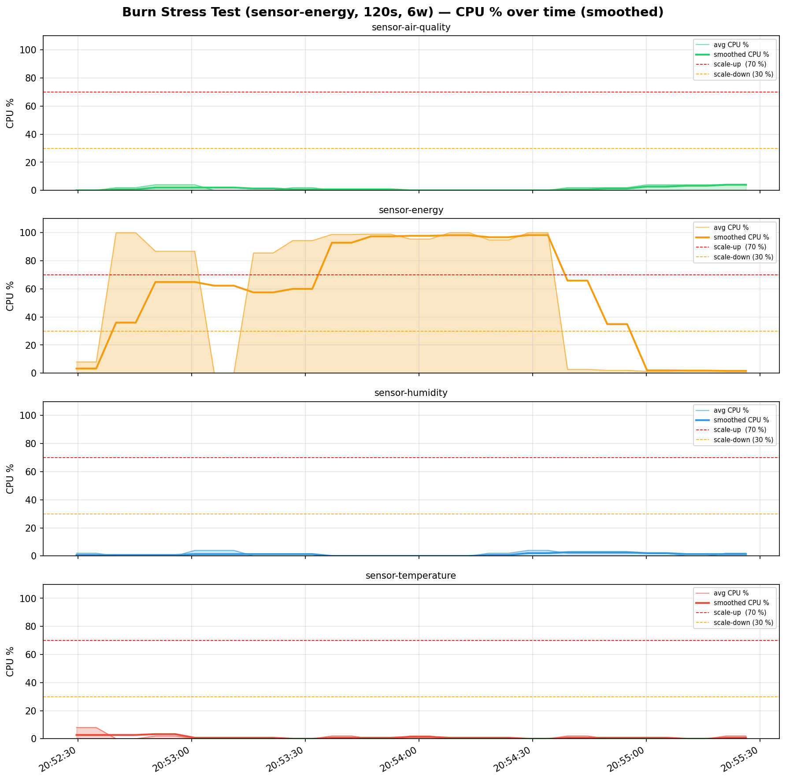
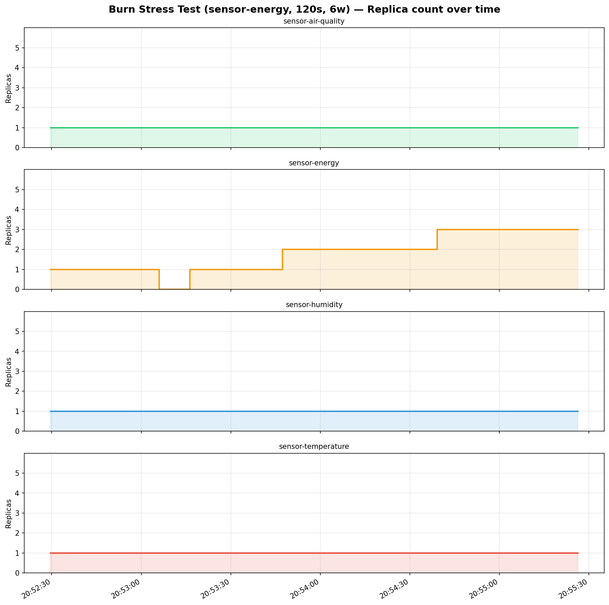
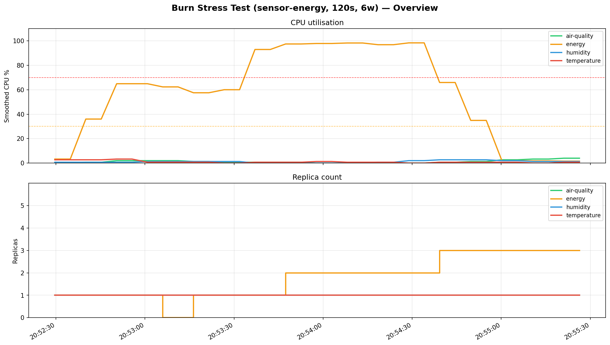

# Burn Stress Test (sensor-energy, 120s, 6w) — Metrics Report

**Period:** 2026-05-12 20:52:29 UTC → 2026-05-12 20:55:26 UTC (176s)
**Samples collected:** 140
**Sensors monitored:** 4

---

## Summary

| Sensor      |   Samples |   CPU min % |   CPU max % |   CPU avg % |   CPU smooth max % |   Replicas min |   Replicas max |
|-------------|-----------|-------------|-------------|-------------|--------------------|----------------|----------------|
| air-quality |        35 |           0 |           4 |         1.5 |                4   |              1 |              1 |
| energy      |        35 |           0 |         100 |        58   |               98.3 |              0 |              3 |
| humidity    |        35 |           0 |           4 |         1.3 |                2.7 |              1 |              1 |
| temperature |        35 |           0 |           8 |         1   |                3.3 |              1 |              1 |

---

## Scale Events

| Time     | Sensor   |   Old replicas |   New replicas | Event        |   Smoothed CPU % |
|----------|----------|----------------|----------------|--------------|------------------|
| 20:53:05 | energy   |              1 |              0 | ↓ scale-down |             62.3 |
| 20:53:16 | energy   |              0 |              1 | ↑ scale-up   |             57.5 |
| 20:53:47 | energy   |              1 |              2 | ↑ scale-up   |             97.4 |
| 20:54:39 | energy   |              2 |              3 | ↑ scale-up   |             65.9 |

---

## Charts

### CPU utilisation over time

### Replica count over time

### Overview (all sensors)

---

## Raw samples (every 5th)

| Time     | Sensor      |   Replicas |   Avg CPU % |   Smoothed CPU % |
|----------|-------------|------------|-------------|------------------|
| 20:52:29 | temperature |          1 |         8   |              2.7 |
| 20:52:34 | humidity    |          1 |         2   |              0.7 |
| 20:52:40 | energy      |          1 |       100   |             36   |
| 20:52:45 | air-quality |          1 |         2   |              0.7 |
| 20:52:55 | temperature |          1 |         2   |              3.3 |
| 20:53:00 | humidity    |          1 |         4   |              1.3 |
| 20:53:05 | energy      |          0 |         0   |             62.3 |
| 20:53:11 | air-quality |          1 |         0   |              2   |
| 20:53:21 | temperature |          1 |         0   |              0.7 |
| 20:53:26 | humidity    |          1 |         0   |              1.3 |
| 20:53:31 | energy      |          1 |        94.4 |             60   |
| 20:53:37 | air-quality |          1 |         0   |              0.7 |
| 20:53:47 | temperature |          1 |         0   |              0.7 |
| 20:53:52 | humidity    |          1 |         0   |              0   |
| 20:53:57 | energy      |          2 |        95.5 |             97.8 |
| 20:54:02 | air-quality |          1 |         0   |              0   |
| 20:54:13 | temperature |          1 |         0   |              0.7 |
| 20:54:18 | humidity    |          1 |         2   |              0.7 |
| 20:54:23 | energy      |          2 |        94.9 |             96.8 |
| 20:54:28 | air-quality |          1 |         0   |              0   |
| 20:54:39 | temperature |          1 |         2   |              0.7 |
| 20:54:44 | humidity    |          1 |         2   |              2.7 |
| 20:54:49 | energy      |          3 |         2   |             34.9 |
| 20:54:54 | air-quality |          1 |         2   |              1.3 |
| 20:55:05 | temperature |          1 |         0   |              0.7 |
| 20:55:10 | humidity    |          1 |         0   |              1.3 |
| 20:55:15 | energy      |          3 |         2   |              1.8 |
| 20:55:21 | air-quality |          1 |         4   |              4   |
