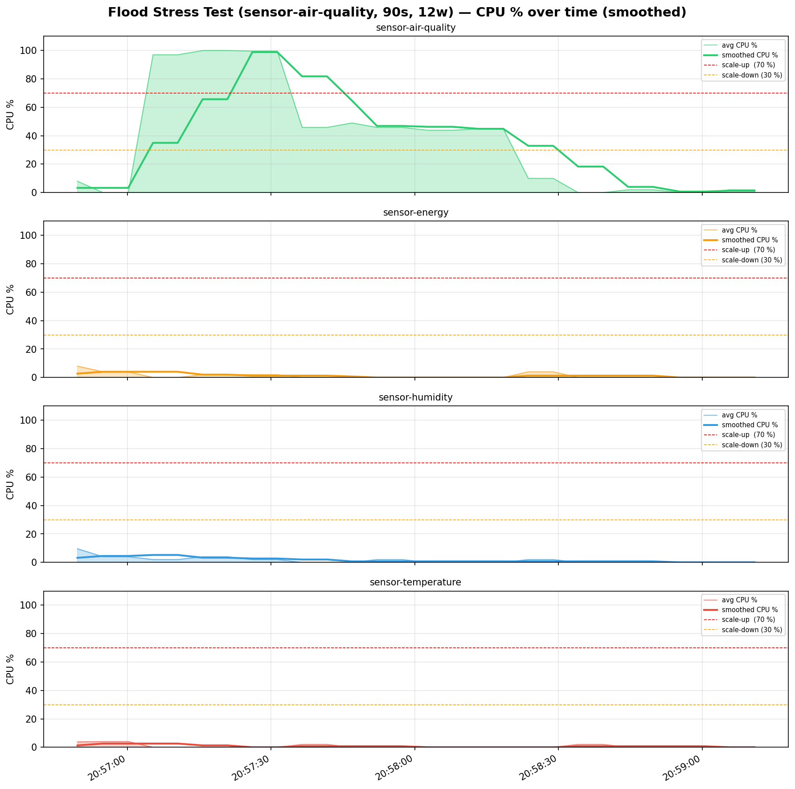
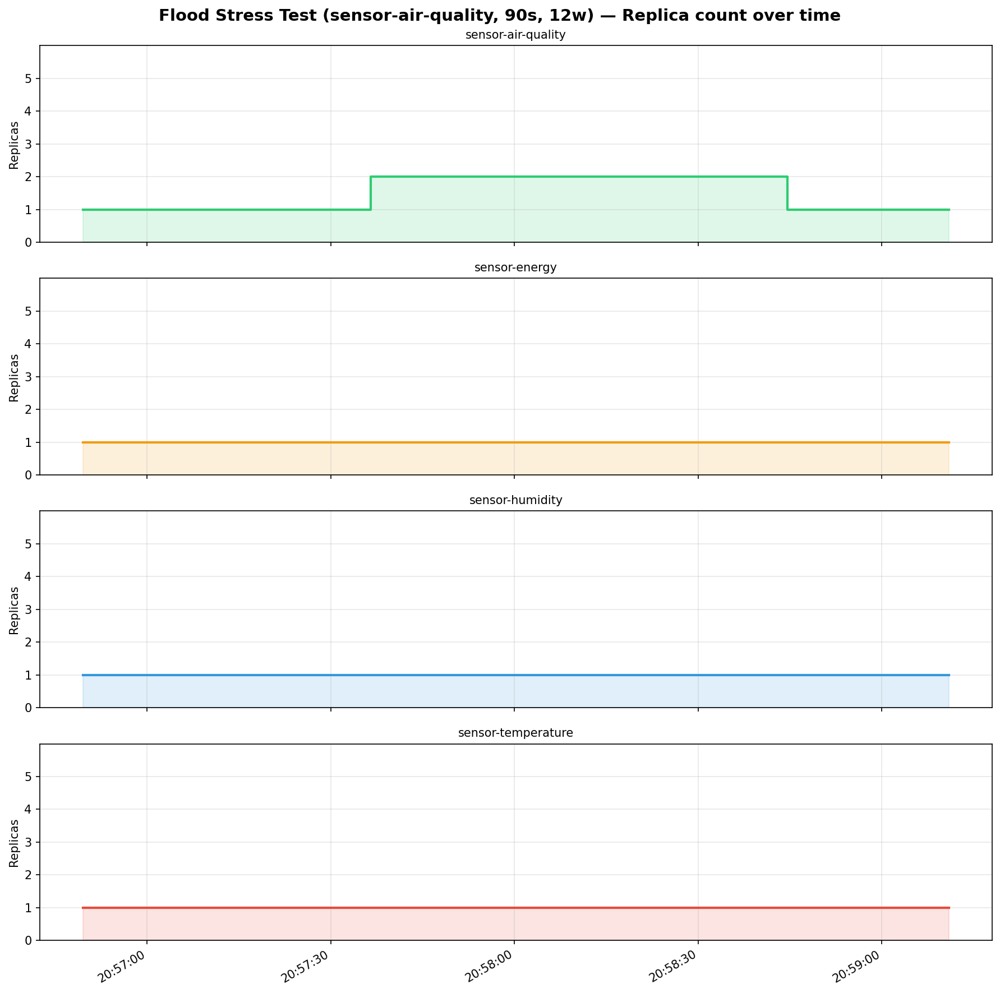
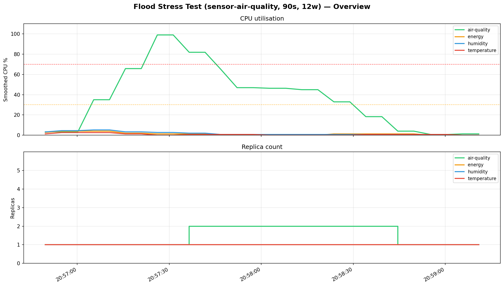

# Flood Stress Test (sensor-air-quality, 90s, 12w) — Metrics Report

**Period:** 2026-05-12 20:56:49 UTC → 2026-05-12 20:59:10 UTC (141s)
**Samples collected:** 112
**Sensors monitored:** 4

---

## Summary

| Sensor      |   Samples |   CPU min % |   CPU max % |   CPU avg % |   CPU smooth max % |   Replicas min |   Replicas max |
|-------------|-----------|-------------|-------------|-------------|--------------------|----------------|----------------|
| air-quality |        28 |           0 |       100   |        37.1 |               98.9 |              1 |              2 |
| energy      |        28 |           0 |         8   |         1.1 |                4   |              1 |              1 |
| humidity    |        28 |           0 |         9.6 |         1.5 |                5.2 |              1 |              1 |
| temperature |        28 |           0 |         4   |         0.7 |                2.6 |              1 |              1 |

---

## Scale Events

| Time     | Sensor      |   Old replicas |   New replicas | Event        |   Smoothed CPU % |
|----------|-------------|----------------|----------------|--------------|------------------|
| 20:57:36 | air-quality |              1 |              2 | ↑ scale-up   |             81.8 |
| 20:58:44 | air-quality |              2 |              1 | ↓ scale-down |              4   |

---

## Charts

### CPU utilisation over time

### Replica count over time

### Overview (all sensors)

---

## Raw samples (every 5th)

| Time     | Sensor      |   Replicas |   Avg CPU % |   Smoothed CPU % |
|----------|-------------|------------|-------------|------------------|
| 20:56:49 | temperature |          1 |         3.8 |              1.3 |
| 20:56:54 | humidity    |          1 |         4   |              4.5 |
| 20:57:00 | energy      |          1 |         4   |              4   |
| 20:57:05 | air-quality |          1 |        97   |             35   |
| 20:57:15 | temperature |          1 |         0   |              1.3 |
| 20:57:20 | humidity    |          1 |         4   |              3.3 |
| 20:57:26 | energy      |          1 |         2   |              1.3 |
| 20:57:31 | air-quality |          1 |        99.6 |             98.9 |
| 20:57:41 | temperature |          1 |         2   |              0.7 |
| 20:57:46 | humidity    |          1 |         0   |              0.7 |
| 20:57:52 | energy      |          1 |         0   |              0   |
| 20:57:57 | air-quality |          2 |        45.9 |             46.9 |
| 20:58:07 | temperature |          1 |         0   |              0   |
| 20:58:13 | humidity    |          1 |         0   |              0.7 |
| 20:58:18 | energy      |          1 |         0   |              0   |
| 20:58:23 | air-quality |          2 |        10   |             32.9 |
| 20:58:34 | temperature |          1 |         2   |              0.7 |
| 20:58:39 | humidity    |          1 |         0   |              0.7 |
| 20:58:44 | energy      |          1 |         0   |              1.3 |
| 20:58:49 | air-quality |          1 |         2   |              4   |
| 20:59:00 | temperature |          1 |         0   |              0.7 |
| 20:59:05 | humidity    |          1 |         0   |              0   |
| 20:59:10 | energy      |          1 |         0   |              0   |
